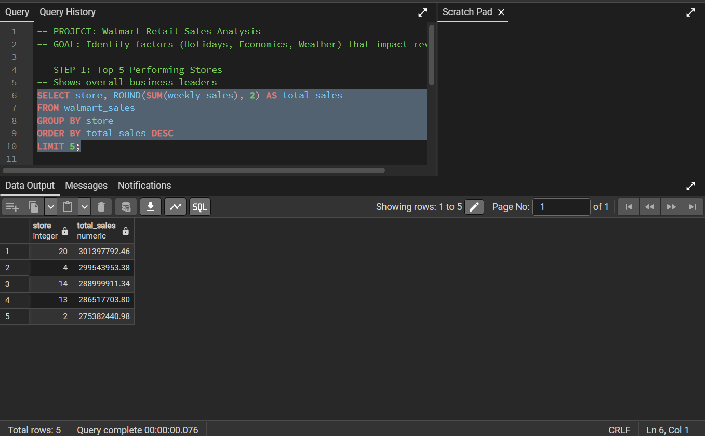
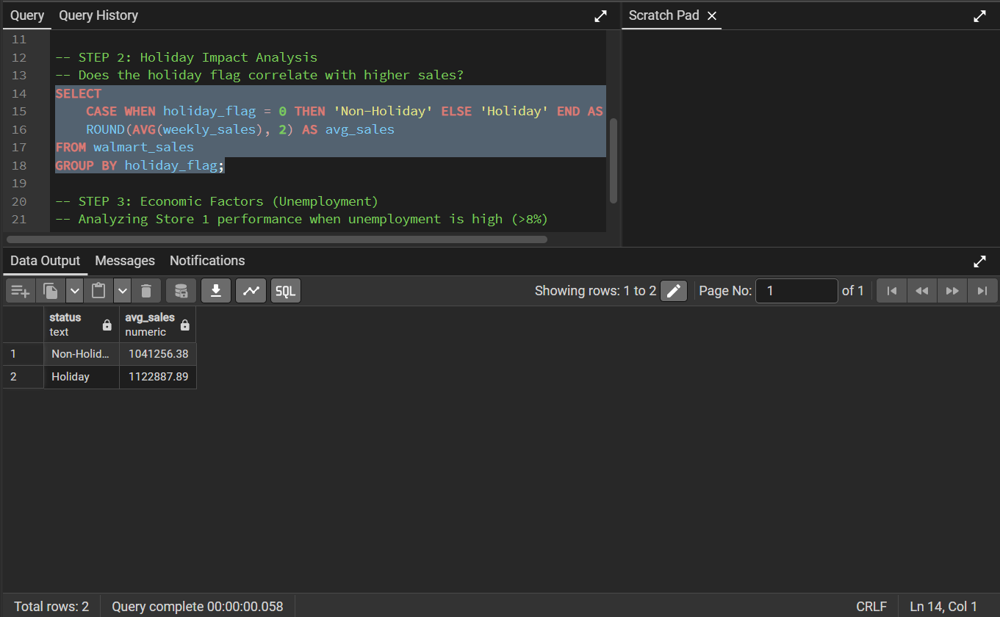
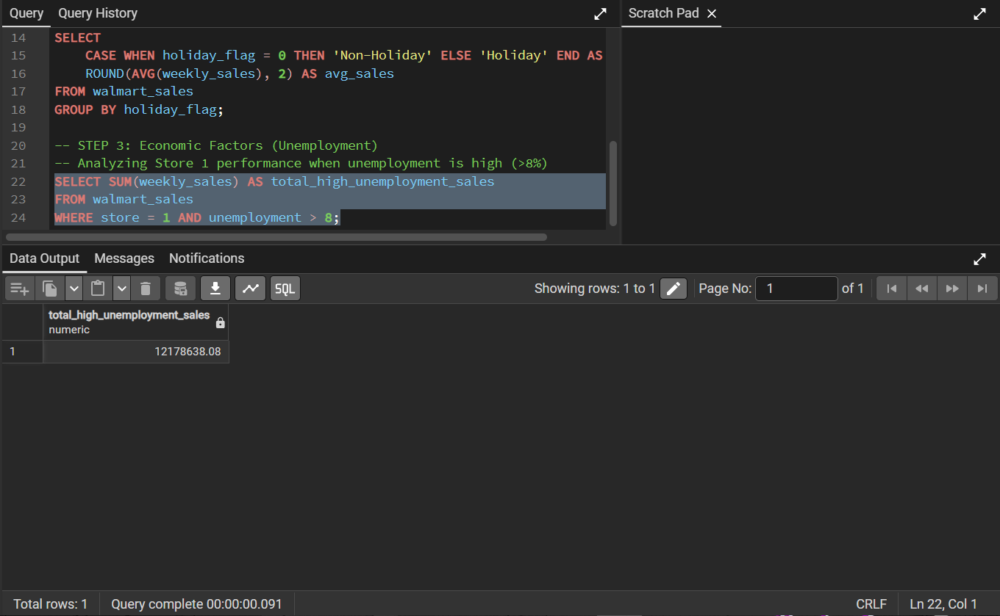

Walmart Retail Sales Analysis
📌 Project Overview
This project analyzes retail data from 45 Walmart stores to identify the primary drivers of weekly revenue. By examining seasonal trends, economic indicators, and environmental factors, this analysis provides actionable insights for inventory planning and labor allocation.

📊 Business Questions Addressed
Who are the top performers? Identified the high-priority stores for resource investment.

Do Holidays drive significant lift? Quantified the revenue difference between holiday and non-holiday periods.

How do external factors impact sales? Analyzed the correlation between high unemployment rates and consumer spending.

Does weather dictate shopping behavior? Grouped sales data by temperature "buckets" to see seasonal impacts.

🛠️ Technical Skills Demonstrated
Data Aggregation: Using SUM(), AVG(), and COUNT() to summarize 6,400+ rows of data.

Conditional Logic: Implementing CASE WHEN statements to categorize continuous variables (Temperature/Holidays).

Data Filtering: Using complex WHERE clauses to isolate specific economic conditions.

Result Formatting: Rounding values and aliasing columns for stakeholder-ready reporting.

🔍 Key Insights & SQL Evidence
1. Revenue by Store
I identified the top 5 stores contributing the most to total company revenue. This allows management to focus optimization efforts on high-volume locations.

2. The "Holiday Lift"
Analysis revealed a clear increase in average weekly sales during holiday weeks. This supports the business case for increased marketing spend during these periods.

3. Economic Sensitivity
By filtering for weeks with unemployment rates above 8%, I tracked how consumer spending in Store 1 responded to local economic downturns.

📂 Project Structure
Walmart_Sales.csv: The raw dataset containing historical sales records.

walmart_analysis.sql: The complete SQL script containing all analytical queries.

README.md: Project documentation and summary of findings.
